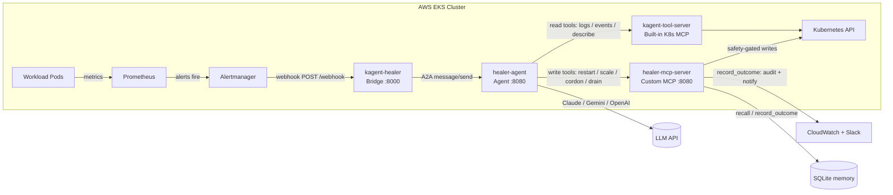

# Self-Healing Kubernetes Cluster with KAgent

[](https://github.com/Abhiram-Rakesh/Self-Healing-K8s-Kagent/actions/workflows/ci.yml)
[](LICENSE)
[](https://www.python.org/)
[](https://kubernetes.io/)
[](https://aws.amazon.com/eks/)
[](https://www.terraform.io/)

An AI-powered self-healing platform for Amazon EKS built on the
[kagent](https://kagent.dev) framework. Prometheus alerts are routed to a thin
bridge that forwards them to a kagent-managed AI agent. The agent
investigates using kagent's built-in Kubernetes MCP tools, then executes
remediation (restart, scale, cordon, or drain) through a custom safety-gated MCP
server behind a confidence threshold and a dry-run gate.

The LLM provider is **pluggable** — switch between Anthropic Claude, Google
Gemini, OpenAI, Ollama, and others by changing one field in the `ModelConfig`
CRD. The default configuration uses **Claude Haiku** (fast, cost-effective); a
`gemini-model-config.yaml` is also provided for easy rollback.

---

## Architecture diagram



---

## Tech stack

| Layer            | Technology                       | Purpose                                                       |
|------------------|----------------------------------|---------------------------------------------------------------|
| Infrastructure   | AWS EKS, VPC, ECR, Secrets Mgr   | Managed Kubernetes + image registry + secret store            |
| IaC              | Terraform 1.10+, S3 native locking  | Reproducible cluster provisioning (no DynamoDB needed)     |
| Observability    | kube-prometheus-stack, Loki, Grafana | Metrics, logs, alerting, dashboards                       |
| Chaos            | Litmus ChaosCenter               | Repeatable failure injection                                  |
| AI               | Anthropic Claude / Google Gemini (pluggable) | LLM — driven by kagent's tool-calling loop; default: Claude Haiku |
| Agent framework  | [kagent](https://kagent.dev) (CNCF sandbox) | Manages Agent CRD, LLM loop, built-in K8s MCP tools |
| Custom MCP server| Python 3.11 + FastMCP            | Safety-gated write tools, HITL approval, SQLite memory        |
| Bridge           | Python 3.11 (stdlib HTTP server) | Thin Alertmanager→kagent forwarder with dedup                 |
| Memory           | SQLite (stdlib)                  | Past incident store — no external DB needed                   |
| Packaging        | Docker (multi-stage, non-root, amd64+arm64) | Reproducible agent image, runs on Graviton nodes     |
| Deployment       | Helm v3                          | Templated K8s install of the agent                            |
| CI/CD            | GitHub Actions + OIDC            | Lint, test, build, push, tag, terraform plan/apply            |

---

## Prerequisites

You need the seven tools below installed locally before running anything in
this repo. Each section shows install commands and a verify-step with the
exact output to expect.

### 1. AWS CLI v2

Linux:
```bash
curl "https://awscli.amazonaws.com/awscli-exe-linux-x86_64.zip" -o "awscliv2.zip"
unzip awscliv2.zip
sudo ./aws/install
```

macOS (Homebrew):
```bash
brew install awscli
```

Windows (PowerShell, as Administrator):
```powershell
msiexec.exe /i https://awscli.amazonaws.com/AWSCLIV2.msi
```

Configure credentials and verify:
```bash
aws configure
aws sts get-caller-identity
```

Expected output:
```
{
    "UserId": "AIDAEXAMPLE",
    "Account": "123456789012",
    "Arn": "arn:aws:iam::123456789012:user/your-name"
}
```

**Success indicator:** `Account` shows your 12-digit AWS account ID.

### 2. Terraform >= 1.10

Linux:
```bash
wget -O - https://apt.releases.hashicorp.com/gpg | sudo gpg --dearmor -o /usr/share/keyrings/hashicorp-archive-keyring.gpg
echo "deb [signed-by=/usr/share/keyrings/hashicorp-archive-keyring.gpg] https://apt.releases.hashicorp.com $(lsb_release -cs) main" | sudo tee /etc/apt/sources.list.d/hashicorp.list
sudo apt-get update && sudo apt-get install terraform
```

macOS:
```bash
brew tap hashicorp/tap
brew install hashicorp/tap/terraform
```

Verify:
```bash
terraform --version
```

Expected output:
```
Terraform v1.10.5
```

**Success indicator:** Version is 1.10 or newer.

### 3. kubectl (pinned to 1.32)

Linux:
```bash
curl -LO "https://dl.k8s.io/release/v1.32.0/bin/linux/amd64/kubectl"
sudo install -o root -g root -m 0755 kubectl /usr/local/bin/kubectl
```

macOS:
```bash
brew install kubernetes-cli
```

Verify:
```bash
kubectl version --client
```

Expected output:
```
Client Version: v1.32.0
Kustomize Version: v5.5.0
```

**Success indicator:** Client version starts with `v1.32`.

### 4. Helm v3

Linux / macOS:
```bash
curl https://raw.githubusercontent.com/helm/helm/main/scripts/get-helm-3 | bash
```

Verify:
```bash
helm version
```

Expected output:
```
version.BuildInfo{Version:"v3.14.4", GitCommit:"...", ...}
```

**Success indicator:** Version is v3.x.

### 5. Docker

Linux:
```bash
curl -fsSL https://get.docker.com | sh
sudo usermod -aG docker "$USER"
newgrp docker
```

macOS:
```bash
brew install --cask docker
open -a Docker
```

Verify:
```bash
docker run hello-world
```

Expected output:
```
Hello from Docker!
This message shows that your installation appears to be working correctly.
```

**Success indicator:** The Docker daemon prints the "Hello from Docker!" message.

### 6. LLM API key (Anthropic or Gemini)

The agent is LLM-agnostic — pick whichever provider you have a key for. Both
`ModelConfig` files are included; you only need to apply the one you use.

**Option A — Anthropic Claude (default)**

Get a key at https://console.anthropic.com → **API Keys**.

Verify:
```bash
export ANTHROPIC_API_KEY=sk-ant-...
curl -s https://api.anthropic.com/v1/models \
  -H "x-api-key: $ANTHROPIC_API_KEY" \
  -H "anthropic-version: 2023-06-01" | jq '.data[0].id'
```

Expected output: `"claude-haiku-4-5-20251001"` (or similar).

**Option B — Google Gemini**

Generate a free key at https://aistudio.google.com → **Get API key**.

Verify:
```bash
export GEMINI_API_KEY=your-key-here
curl -s "https://generativelanguage.googleapis.com/v1beta/models?key=${GEMINI_API_KEY}" \
  | jq '.models[0].name'
```

Expected output: `"models/gemini-2.5-flash"`

**Success indicator:** A model name string is returned (no `error:` block).

### 7. jq (used by the verify steps above)

Linux:
```bash
sudo apt-get install jq
```

macOS:
```bash
brew install jq
```

### AWS IAM requirements

The IAM principal you use for `terraform apply` needs these AWS managed
policies (or an equivalent custom policy):

| Policy                                | Why it's needed                                                  |
|---------------------------------------|------------------------------------------------------------------|
| `AmazonEC2FullAccess`                 | VPC, subnets, NAT gateways, EIPs, security groups                |
| `AmazonEKSClusterPolicy` (attach to role created by TF) | Standard EKS control-plane permissions      |
| `IAMFullAccess`                       | Create the cluster, node, and IRSA roles + policies              |
| `AmazonEC2ContainerRegistryFullAccess`| Create + push to the `kagent-healer` ECR repository              |
| `SecretsManagerReadWrite`             | Push the LLM API key + Slack webhook to Secrets Manager          |
| `AmazonS3FullAccess`                  | Terraform state bucket access                                    |
| `CloudWatchLogsFullAccess`            | Cluster log groups                                               |

Production accounts should narrow these — the policies above are a fast-path
for a fresh dev account.

---

## Deployment — step by step

### Step 1 — Fork and clone the repository

```bash
git clone https://github.com/Abhiram-Rakesh/Self-Healing-K8s-Kagent.git
cd Self-Healing-K8s-Kagent
```

**Success indicator:** `ls` shows `Makefile`, `terraform/`, `agent/`, `helm/`,
`k8s/`, `scripts/`.

### Step 2 — Create the Terraform state bucket

Terraform 1.10+ uses [S3 native state locking](https://developer.hashicorp.com/terraform/language/backend/s3#state-locking) via
conditional writes — no DynamoDB table required.

```bash
export AWS_REGION=ap-south-1
export TF_STATE_BUCKET="my-name-tf-state-$(aws sts get-caller-identity --query Account --output text)"

# Create the S3 bucket with versioning + encryption.
aws s3api create-bucket \
  --bucket "$TF_STATE_BUCKET" \
  --region "$AWS_REGION" \
  --create-bucket-configuration LocationConstraint="$AWS_REGION"

aws s3api put-bucket-versioning \
  --bucket "$TF_STATE_BUCKET" \
  --versioning-configuration Status=Enabled

aws s3api put-bucket-encryption \
  --bucket "$TF_STATE_BUCKET" \
  --server-side-encryption-configuration '{
    "Rules": [{"ApplyServerSideEncryptionByDefault": {"SSEAlgorithm": "AES256"}}]
  }'
```

Verify:
```bash
aws s3 ls | grep "$TF_STATE_BUCKET"
```

Expected output:
```
2026-05-18 12:34:56 my-name-tf-state-123456789012
```

**Success indicator:** Bucket appears in `aws s3 ls` with versioning enabled.

### Step 3 — Configure and provision infrastructure

Copy the example tfvars file and edit it:
```bash
cp terraform/terraform.tfvars.example terraform/terraform.tfvars
```

Open `terraform/terraform.tfvars` and set these values:

| Variable             | Example                                  | Notes                                                    |
|----------------------|------------------------------------------|----------------------------------------------------------|
| `aws_region`         | `ap-south-1`                              | Match the region you used in Step 2                      |
| `cluster_name`       | `self-healing-cluster`                   | Becomes the EKS cluster name                             |
| `cluster_version`    | `1.32`                                   | Pinned to match the kubectl version                      |
| `environment`        | `dev`                                    | `dev` keeps NAT GW at 1 by default — cheaper             |
| `system_node_type`   | `t3.medium`                              | Used by add-ons (coredns, monitoring, kagent control plane) |
| `workload_node_type` | `t3.large`                               | Used by demo workloads + healer agent                    |
| `system_node_count`  | `2`                                      | Two nodes survives a single AZ failure                   |
| `workload_node_count`| `2`                                      | Two = the minimum for HPA experiments                    |
| `enable_ha_nat`      | `false`                                  | `true` = one NAT GW per AZ (~3x the cost)                |
| `state_bucket`       | `my-name-tf-state-123456789012`          | The bucket you created in Step 2                         |
| `gemini_api_key`     | from https://aistudio.google.com         | Optional — only if using Gemini provider; stored in Secrets Manager |
| `slack_webhook_url`  | optional `https://hooks.slack.com/...`   | Leave empty to disable Slack notifications               |

Initialize, plan, apply:
```bash
cd terraform
terraform init \
  -backend-config="bucket=${TF_STATE_BUCKET}" \
  -backend-config="region=${AWS_REGION}"

terraform plan -var-file=terraform.tfvars -out=tfplan
terraform apply tfplan
cd ..
```

Expected output (last lines of `apply`):
```
Apply complete! Resources: 47 added, 0 changed, 0 destroyed.

Outputs:

aws_account_id = "123456789012"
aws_region = "ap-south-1"
cluster_endpoint = "https://EXAMPLE.gr7.ap-south-1.eks.amazonaws.com"
cluster_name = "self-healing-cluster"
ecr_repository_url = "123456789012.dkr.ecr.ap-south-1.amazonaws.com/kagent-healer"
gemini_secret_arn = "arn:aws:secretsmanager:ap-south-1:123456789012:secret:kagent/gemini-api-key-AbCdEf"
kagent_irsa_role_arn = "arn:aws:iam::123456789012:role/kagent-healer-irsa"
kubeconfig_command = "aws eks update-kubeconfig --region ap-south-1 --name self-healing-cluster"
private_subnet_ids = ["subnet-aaa", "subnet-bbb", "subnet-ccc"]
public_subnet_ids = ["subnet-xxx", "subnet-yyy", "subnet-zzz"]
vpc_id = "vpc-0abcdef0123456789"
```

Export the outputs you'll reuse:
```bash
export ECR_URL=$(terraform -chdir=terraform output -raw ecr_repository_url)
export KAGENT_IRSA_ARN=$(terraform -chdir=terraform output -raw kagent_irsa_role_arn)
export AWS_ACCOUNT_ID=$(terraform -chdir=terraform output -raw aws_account_id)
```

**Success indicator:** `aws eks list-clusters --region $AWS_REGION` includes
`self-healing-cluster`.

### Step 4 — Configure kubectl

```bash
aws eks update-kubeconfig --region "$AWS_REGION" --name self-healing-cluster
kubectl get nodes
```

Expected output:
```
NAME                                            STATUS   ROLES    AGE   VERSION
ip-10-0-1-12.ap-south-1.compute.internal         Ready    <none>   3m    v1.32.0-eks-...
ip-10-0-2-45.ap-south-1.compute.internal         Ready    <none>   3m    v1.32.0-eks-...
ip-10-0-3-78.ap-south-1.compute.internal         Ready    <none>   3m    v1.32.0-eks-...
ip-10-0-1-90.ap-south-1.compute.internal         Ready    <none>   3m    v1.32.0-eks-...
```

**Success indicator:** All nodes show `STATUS=Ready` and run version `v1.32.x`.

Then mark `gp2` as the cluster-default StorageClass. EKS provisions `gp2` but does not flag it as default, which breaks any Helm chart that doesn't set an explicit `storageClassName` (Loki, Litmus MongoDB, etc.):

```bash
kubectl patch storageclass gp2 \
  -p '{"metadata": {"annotations":{"storageclass.kubernetes.io/is-default-class":"true"}}}'

kubectl get storageclass
# Expected: NAME  gp2 (default)
```

### Step 5 — Install cluster add-ons

#### 5a — Metrics Server

```bash
kubectl apply -f https://github.com/kubernetes-sigs/metrics-server/releases/latest/download/components.yaml
sleep 30
kubectl top nodes
```

Expected output:
```
NAME                                       CPU(cores)   CPU%   MEMORY(bytes)   MEMORY%
ip-10-0-1-12.ap-south-1.compute.internal    47m          2%     412Mi           12%
...
```

**Success indicator:** Each node shows non-empty CPU% and MEMORY% values.

#### 5b — kube-prometheus-stack

```bash
helm repo add prometheus-community https://prometheus-community.github.io/helm-charts
helm repo update

helm upgrade --install monitoring prometheus-community/kube-prometheus-stack \
  --namespace monitoring --create-namespace \
  --set grafana.adminPassword='admin' \
  --set prometheus.prometheusSpec.serviceMonitorSelectorNilUsesHelmValues=false \
  --set prometheus.prometheusSpec.ruleSelectorNilUsesHelmValues=false \
  --set alertmanager.alertmanagerSpec.alertmanagerConfigMatcherStrategy.type=None \
  --wait
```

Verify:
```bash
kubectl get pods -n monitoring
```

Expected output (abbreviated):
```
NAME                                                     READY   STATUS    RESTARTS   AGE
alertmanager-monitoring-kube-prometheus-alertmanager-0   2/2     Running   0          2m
monitoring-grafana-78d9b9f786-2xkp4                      3/3     Running   0          2m
monitoring-kube-prometheus-operator-...                  1/1     Running   0          2m
monitoring-kube-state-metrics-...                        1/1     Running   0          2m
monitoring-prometheus-node-exporter-...                  1/1     Running   0          2m
prometheus-monitoring-kube-prometheus-prometheus-0       2/2     Running   0          2m
```

**Success indicator:** Every monitoring pod is `Running` with no `RESTARTS`.

#### 5c — Loki + Promtail

Loki ships pod logs to Grafana so the **"Recent healing events"** dashboard panel
and the log-based alert rules work. Promtail runs as a DaemonSet and tails every
node's container logs.

```bash
helm repo add grafana https://grafana.github.io/helm-charts
helm repo update

helm upgrade --install loki grafana/loki-stack \
  --namespace monitoring --create-namespace \
  -f helm/loki/values.yaml --wait
```

Apply the datasource ConfigMap so Grafana's sidecar auto-provisions Loki — no
manual datasource setup needed:

```bash
kubectl apply -f k8s/monitoring/loki-datasource.yaml
```

Verify:
```bash
kubectl get pods -n monitoring | grep loki
```

Expected output:
```
loki-0                             1/1     Running   0          90s
loki-promtail-abcd1                1/1     Running   0          90s
loki-promtail-abcd2                1/1     Running   0          90s
loki-promtail-abcd3                1/1     Running   0          90s
```

**Success indicator:** `loki-0` is `Running` and one `loki-promtail-*` pod exists
per node. In Grafana → Configuration → Data sources you should see **Loki** listed.

#### 5d — Litmus ChaosCenter + chaos operator

`litmuschaos/litmus` 3.x installs the **ChaosCenter management UI only**. The
chaos-operator (which provides the `ChaosEngine` / `ChaosExperiment` CRDs and
runs experiments) ships as a separate chart (`litmus-core`). Both are required.

```bash
helm repo add litmuschaos https://litmuschaos.github.io/litmus-helm/
helm repo update

# ChaosCenter (UI + MongoDB)
helm install litmus litmuschaos/litmus \
  --namespace litmus --create-namespace \
  --wait

# Chaos operator — installs ChaosEngine / ChaosExperiment / ChaosResult CRDs
helm install litmus-core litmuschaos/litmus-core \
  --namespace litmus \
  --wait

# RBAC for the chaos runner service account
kubectl apply -f k8s/chaos/litmus-rbac.yaml
```

Verify:
```bash
kubectl get pods -n litmus
kubectl api-resources | grep litmuschaos   # should show chaosengines, chaosexperiments, chaosresults
```

**Success indicator:** All Litmus pods `Running` and `chaosengines` CRD present.

#### 5e — kagent framework

kagent is the AI agent framework that manages the LLM tool-calling loop, the
Agent CRD, and the built-in Kubernetes MCP tools.

```bash
# Install CRDs first
helm install kagent-crds \
  oci://ghcr.io/kagent-dev/kagent/helm/kagent-crds \
  --namespace kagent --create-namespace
sleep 15

# Install kagent (provider-agnostic — LLM is set via ModelConfig CRD, not here)
helm install kagent \
  oci://ghcr.io/kagent-dev/kagent/helm/kagent \
  --namespace kagent \
  --wait
```

Create the LLM API key secret for whichever provider you chose in Step 6:

**Anthropic (default):**
```bash
kubectl create secret generic kagent-anthropic \
  -n kagent \
  --from-literal ANTHROPIC_API_KEY="$ANTHROPIC_API_KEY" \
  --dry-run=client -o yaml | kubectl apply -f -
```

**Gemini (alternative):**
```bash
kubectl create secret generic kagent-gemini \
  -n kagent \
  --from-literal GOOGLE_API_KEY="$GEMINI_API_KEY" \
  --dry-run=client -o yaml | kubectl apply -f -
```

Apply the kagent resources (ModelConfig, RemoteMCPServer, Agent CRDs):
```bash
# These are applied AFTER the healer is deployed (Step 9) so the MCP service URL resolves.
# See Step 9b below.
```

Verify:
```bash
kubectl get pods -n kagent
```

**Success indicator:** All kagent pods (controller, UI, engine) show `Running`.

### Step 6 — Push secrets to AWS Secrets Manager

The Slack webhook URL (optional) goes through Secrets Manager so it's never in
code. The LLM API key is stored directly in a K8s Secret in the `kagent`
namespace (referenced by the `ModelConfig` CRD) — see Step 5e above.

```bash
# (optional) Slack webhook
aws secretsmanager put-secret-value \
  --secret-id kagent/slack-webhook \
  --secret-string "https://hooks.slack.com/services/..." \
  --region "$AWS_REGION"
```

Verify:
```bash
aws secretsmanager get-secret-value \
  --secret-id kagent/slack-webhook \
  --region "$AWS_REGION" \
  --query SecretString --output text | head -c 8 ; echo
```

**Success indicator:** The first 8 characters of your key are printed.

### Step 7 — Apply alert rules and Grafana dashboard

```bash
kubectl apply -f k8s/monitoring/alert-rules.yaml
kubectl apply -f k8s/monitoring/alertmanager-config.yaml
kubectl apply -f k8s/monitoring/loki-datasource.yaml
kubectl apply -f k8s/monitoring/grafana-dashboard-configmap.yaml

kubectl get prometheusrule -n monitoring
```

Expected output:
```
NAME                                                    AGE
kagent-healer-rules                                     10s
...
```

**Success indicator:** `kagent-healer-rules` is listed. Open Grafana → Alerting
→ Alert rules to confirm 5 rules under group `kagent.healing`.

### Step 8 — Build and push the agent image

```bash
export ECR_URL=$(terraform -chdir=terraform output -raw ecr_repository_url)
export AWS_ACCOUNT_ID=$(terraform -chdir=terraform output -raw aws_account_id)
echo "ECR: ${ECR_URL}"

aws ecr get-login-password --region "$AWS_REGION" | \
  docker login --username AWS --password-stdin "${ECR_URL}"

docker build -t kagent-healer:latest .

docker tag kagent-healer:latest "${ECR_URL}:latest"
docker push "${ECR_URL}:latest"
```

Expected output (last lines):
```
latest: digest: sha256:abc123... size: 1234
```

Verify image is in ECR:
```bash
aws ecr describe-images --repository-name kagent-healer --region "$AWS_REGION" \
  --query 'imageDetails[*].{Tag:imageTags[0],Pushed:imagePushedAt,Size:imageSizeInBytes}'
```

**Success indicator:** Image appears with tag `latest` and a recent push timestamp.

### Step 9 — Deploy the healer

#### 9a — Deploy the kagent-healer Helm chart

The healer Helm chart deploys two components in one pod:
- **Bridge** (`:8000`) — receives Alertmanager webhooks, deduplicates, forwards to kagent
- **Custom MCP server** (`:8080`) — safety-gated write tools that kagent calls via SSE

```bash
helm upgrade --install kagent-healer helm/kagent-healer/ \
  --namespace default \
  --set image.repository="${ECR_URL}" \
  --set image.tag=latest \
  --set serviceAccount.annotations."eks\.amazonaws\.com/role-arn"="${KAGENT_IRSA_ARN}" \
  --set agent.dryRun="true" \
  --wait
```

For production clusters, overlay `values-prod.yaml` which enables live healing,
higher confidence threshold (0.80), PodDisruptionBudget, NetworkPolicy, and
**persistent storage** for the incident memory and audit log (survives pod restarts).

```bash
helm upgrade --install kagent-healer helm/kagent-healer/ \
  --namespace default \
  -f helm/kagent-healer/values-prod.yaml \
  --set image.repository="${ECR_URL}" \
  --set image.tag=latest \
  --set serviceAccount.annotations."eks\.amazonaws\.com/role-arn"="${KAGENT_IRSA_ARN}" \
  --wait

kubectl get pods -l app.kubernetes.io/name=kagent-healer
```

Expected output:
```
NAME                              READY   STATUS    RESTARTS   AGE
kagent-healer-6d8f9b7c4-xk2pv     1/1     Running   0          45s
```

Verify the health endpoint via port-forward:
```bash
kubectl port-forward svc/kagent-healer 8000:8000 &
sleep 2
curl http://localhost:8000/health
kill %1 2>/dev/null
```

Expected response:
```json
{"status":"ok","version":"2.0.0"}
```

**Success indicator:** Pod shows `1/1 Running` and `/health` returns `{"status":"ok"}`.

#### 9b — Apply kagent CRDs (ModelConfig, RemoteMCPServer, Agent)

Once the healer service is up, apply the kagent resource definitions. The
`RemoteMCPServer` URL must resolve, so this step comes after 9a.

```bash
# Apply the ModelConfig for your chosen LLM (apply both to keep rollback easy):
kubectl apply -f k8s/kagent/claude-model-config.yaml   # Anthropic Claude (default)
kubectl apply -f k8s/kagent/model-config.yaml           # Gemini (alternative)

kubectl apply -f k8s/kagent/remote-mcp-server.yaml
# Apply the ConfigMap BEFORE the Agent CRD (the Agent CRD mounts it)
kubectl apply -f k8s/kagent/agent-patch-configmap.yaml
kubectl apply -f k8s/kagent/agent.yaml
```

`agent.yaml` points to `claude-model-config` by default. To switch providers,
edit `spec.declarative.modelConfig` in `agent.yaml` and re-apply.

Verify:
```bash
kubectl get modelconfig,remotemcpserver,agent -n kagent
```

Expected output:
```
NAME                                          AGE
modelconfig.kagent.dev/claude-model-config    10s
modelconfig.kagent.dev/gemini-model-config    10s

NAME                                              AGE
remotemcpserver.kagent.dev/kagent-tool-server     5m
remotemcpserver.kagent.dev/healer-mcp-server      10s

NAME                               AGE
agent.kagent.dev/healer-agent      10s
```

**Success indicator:** `healer-agent` appears and `healer-mcp-server` shows `AGE > 0`.

### Step 10 — Verify the end-to-end healing loop

Inject a crash-looping deployment:
```bash
kubectl apply -f k8s/test-workloads/crash-loop.yaml
kubectl get pods -n default -w
```

Wait until the pod shows `CrashLoopBackOff`. In another terminal, tail the
agent logs:
```bash
kubectl logs -n default -l app.kubernetes.io/name=kagent-healer -f
```

Expected log lines (bridge + kagent controller + healer MCP server):
```
# Bridge log (kagent-healer pod)
2026-05-18 12:34:56 INFO agent.bridge | Forwarded PodCrashLooping:default:crash-test to kagent → HTTP 200

# kagent controller log (kagent namespace)
2026-05-18 12:34:56 INFO kagent | Starting agent run healer-agent for task <task-id>
2026-05-18 12:34:57 INFO kagent | Tool call: recall_past_cases(alert_type=PodCrashLooping)
2026-05-18 12:34:57 INFO kagent | Tool call: k8s_get_pod_logs(namespace=default, pod=crash-test-...)
2026-05-18 12:34:58 INFO kagent | Tool call: k8s_get_events(namespace=default, resource=crash-test-...)
2026-05-18 12:34:59 INFO kagent | Tool call: restart_deployment(namespace=default, deployment=crash-test, confidence=0.92)

# Custom MCP server log (kagent-healer pod)
2026-05-18 12:34:59 INFO agent.mcp_server | DRY_RUN: would execute restart_deployment on default/crash-test
```

**Success indicator:** Bridge log shows `HTTP 200` forwarding to kagent, and
the healer MCP server log shows `DRY_RUN: would execute restart_deployment` (or
`Restarted deployment/` when `DRY_RUN=false`).

To switch to **live** healing (no dry-run), re-run the Helm command from Step 9
with `--set agent.dryRun="false"` — see [Enabling live healing](#enabling-live-healing-dry_runfalse).

---

## Running the demo

```bash
./scripts/demo.sh
```

The script runs nine phases. Each is annotated below so you can follow what
you're watching on screen:

1. **Cluster health check** — verifies all nodes and the healer pod are Running.
2. **Crash-loop injection** — applies `k8s/test-workloads/crash-loop.yaml`, a
   busybox deployment that exits with code 1 every 5 seconds.
3. **Alert firing** — waits up to 3 minutes (animated spinner) for Prometheus
   to fire the `PodCrashLooping` alert and Alertmanager to deliver it to the
   agent.
4. **LLM diagnosis** — tails the agent log until you see
   `diagnosis: action=...` with a real confidence score.
5. **Healing action** — the `restart_deployment` action is logged (dry-run by default).
6. **OOM injection** — applies `oom-test.yaml`, which immediately exceeds its
   64Mi memory limit and is OOMKilled.
7. **Litmus chaos** — runs a `pod-delete` experiment on the `demo-app`
   deployment.
8. **Audit summary** — prints the last 20 lines of `/tmp/kagent-audit.jsonl`
   inside the agent pod.
9. **Cleanup** — deletes all three test workloads.

At the end the script prints the port-forward commands for Grafana, Prometheus
and Alertmanager.

---

## Healing actions reference

| Alert                | PromQL trigger                                                                            | Action         | Confidence needed | What happens                                                                |
|----------------------|-------------------------------------------------------------------------------------------|----------------|-------------------|-----------------------------------------------------------------------------|
| `PodCrashLooping`    | `kube_pod_container_status_waiting_reason{reason="CrashLoopBackOff"} == 1` for 2m         | `restart_deployment`  | ≥ 0.75            | Safety gates (confidence → protected-namespace → dry-run) enforced inside the MCP write tool. Patches the Deployment's `kubectl.kubernetes.io/restartedAt` annotation. |
| `PodOOMKilled`       | `kube_pod_container_status_last_terminated_reason{reason="OOMKilled"} == 1`               | `restart_deployment` *or* `scale_deployment` | ≥ 0.75 | If the agent sees repeated OOMs across replicas, prefers `scale_deployment`. Original replica count is stored and restored automatically when the alert resolves. |
| `PodPendingTooLong`  | `kube_pod_status_phase{phase="Pending"} == 1` for 5m                                      | `scale_deployment` *or* `notify_only` | ≥ 0.75 | Bumps replicas by 1 up to `MAX_REPLICAS` if cause is taint/resource pressure. Replica count is restored automatically when the alert resolves. |
| `NodeNotReady`       | `kube_node_status_condition{condition="Ready",status="true"} == 0` for 2m                 | `cordon_node` *or* `drain_node` | ≥ 0.80 + HITL | Posts a Slack message with a `POST /approve/<id>` URL. Agent waits up to `APPROVAL_TIMEOUT_SECONDS` (default 300s) then auto-approves. Drain retries PDB-blocked pods with 5s→15s→30s backoff. |
| `PVCUsageHigh`       | `kubelet_volume_stats_used_bytes / kubelet_volume_stats_capacity_bytes > 0.85` for 5m     | `notify_only`  | n/a               | Storage growth is a human decision — agent never resizes PVCs               |

All confidence values below `0.70` are forced to `notify_only` regardless of
the LLM's suggestion (enforced inside each MCP write tool in `agent/mcp_server.py`).

---

## Configuration reference

**kagent healer bridge + custom MCP server** (`helm/kagent-healer/values.yaml`):

| Env var                   | Helm value                        | Description                                                             | Default                                          | Required |
|---------------------------|-----------------------------------|-------------------------------------------------------------------------|--------------------------------------------------|----------|
| `DRY_RUN`                 | `agent.dryRun`                    | If `true`, log write actions but do not touch the cluster               | `true`                                           | no       |
| `CONFIDENCE_THRESHOLD`    | `agent.confidenceThreshold`       | Minimum confidence for write tools to execute                           | `0.75`                                           | no       |
| `MAX_REPLICAS`            | `agent.maxReplicas`               | Hard cap for `scale_deployment`                                         | `10`                                             | no       |
| `DAILY_REQUEST_LIMIT`     | `agent.dailyRequestLimit`         | Max forwarded alerts per UTC day (kagent budget guard)                  | `200`                                            | no       |
| `MEMORY_DB_PATH`          | `agent.memoryDbPath`              | SQLite file for the incident memory                                     | `/tmp/kagent-memory.db`                          | no       |
| `AUDIT_LOG_PATH`          | `agent.auditLogPath`              | JSONL audit log path                                                    | `/tmp/kagent-audit.jsonl`                        | no       |
| `LOG_LEVEL`               | `agent.logLevel`                  | Python log level                                                        | `INFO`                                           | no       |
| `SECRETS_MANAGER_REGION`  | `agent.secretsManagerRegion`      | Region used by boto3 to load Slack webhook at startup                   | `ap-south-1`                                     | no       |
| `SLACK_WEBHOOK_SECRET`    | `agent.slackWebhookSecret`        | Secrets Manager ID for the Slack URL                                    | `kagent/slack-webhook`                           | no       |
| `WEBHOOK_PORT`            | `service.webhookPort`             | HTTP port for the Alertmanager bridge                                   | `8000`                                           | no       |
| `MCP_PORT`                | `service.mcpPort`                 | FastMCP SSE port — kagent calls write tools here                        | `8080`                                           | no       |
| `WEBHOOK_TOKEN`           | `agent.webhookToken`              | If set, `/webhook` requires `Authorization: Bearer <token>`             | `""`                                             | no       |
| `WEBHOOK_BASE_URL`        | `agent.webhookBaseUrl`            | External base URL for clickable `/approve/<id>` links in Slack messages | `""`                                             | no       |
| `KAGENT_AGENT_URL`        | `agent.kagentAgentUrl`            | kagent agent A2A endpoint (A2A v0.3.0, direct to agent service)         | `http://healer-agent.kagent.svc…:8080`           | no       |
| `KAGENT_NAMESPACE`        | `agent.kagentNamespace`           | Namespace where the kagent Agent CRD is deployed                        | `kagent`                                         | no       |
| `KAGENT_AGENT_NAME`       | `agent.kagentAgentName`           | Name of the kagent `Agent` resource to invoke                           | `healer-agent`                                   | no       |
| `APPROVAL_TIMEOUT_SECONDS`| —                                 | Seconds to wait for human HITL approval before auto-approving           | `300`                                            | no       |

**kagent ModelConfig** — controls the LLM kagent uses. Two configs are provided; the active one is set by `spec.declarative.modelConfig` in `agent.yaml`.

| File | Provider | Model | Secret | Key field |
|------|----------|-------|--------|-----------|
| `claude-model-config.yaml` (default) | `Anthropic` | `claude-haiku-4-5-20251001` | `kagent-anthropic` | `ANTHROPIC_API_KEY` |
| `model-config.yaml` | `Gemini` | `gemini-2.5-flash` | `kagent-gemini` | `GOOGLE_API_KEY` |

To switch providers: edit `spec.declarative.modelConfig` in `k8s/kagent/agent.yaml`
(`claude-model-config` → `gemini-model-config` or vice versa), then `kubectl apply -f k8s/kagent/agent.yaml`.

kagent natively supports `Anthropic`, `OpenAI`, `AzureOpenAI`, `Ollama`, `Gemini`,
`GeminiVertexAI`, `AnthropicVertexAI`, `Bedrock` — see the `ModelConfig` CRD schema
for all provider-specific fields.

---

## Observability

The healer pod (bridge + custom MCP server) does **not** expose a standalone
Prometheus metrics endpoint. Observability comes from three sources:

| Source | What it covers | How to access |
|--------|----------------|---------------|
| **kagent controller** | Agent run counts, tool call latency, LLM token usage | `kubectl get --raw /metrics` on the controller pod; kagent UI at `:8083` |
| **Loki / Promtail** | All structured log lines from the healer pod (bridge + MCP server) | Grafana → Explore → Loki → `{app="kagent-healer"}` |
| **Grafana dashboard** | Pre-built panels: healing events log, pod restart trends, alert firing history | `http://localhost:3000` after `make port-forward` |

The Grafana dashboard ConfigMap at `k8s/monitoring/grafana-dashboard-configmap.yaml`
auto-provisions the dashboard via the Grafana sidecar — no manual import needed.

---

## Custom alert rules

To add a new rule:

1. Open [`k8s/monitoring/alert-rules.yaml`](k8s/monitoring/alert-rules.yaml).
2. Append a new entry under `spec.groups[0].rules` with these required
   annotations so the agent can build context:
   ```yaml
   - alert: MyNewAlert
     expr: my_metric{namespace=~".+"} > 0
     for: 2m
     labels:
       severity: warning
       kagent: "true"   # <-- required, so Alertmanager routes it to the healer
     annotations:
       summary: "Something happened in {{ $labels.namespace }}/{{ $labels.pod }}"
       pod: "{{ $labels.pod }}"            # <-- required for MCP investigation tools
       namespace: "{{ $labels.namespace }}"  # <-- required for MCP investigation tools
   ```
3. Apply: `kubectl apply -f k8s/monitoring/alert-rules.yaml`.
4. Verify in Prometheus UI (`/alerts`) and watch the agent log for the first
   firing.

The `kagent: "true"` label is what makes Alertmanager match the route in
`k8s/monitoring/alertmanager-config.yaml`. Without it the alert fires in
Prometheus but never reaches the agent.

### Built-in self-monitoring rules

Two rules in `alert-rules.yaml` watch the agent itself (note `kagent: "false"` —
they fire to your normal alerting channel, not back into the healer):

| Alert | Condition | Severity |
|-------|-----------|----------|
| `KAgentDown` | Healer health endpoint unreachable for 2m (`up{job="kagent-healer"} == 0`) | critical |
| `KAgentHealerMCPUnreachable` | Healer container not-ready for 2m — kagent cannot call write tools | warning |

---

## Enabling live healing (`DRY_RUN=false`)

`DRY_RUN=true` is the default. When dry-run is on, the agent logs the action
it would take but does not patch any Kubernetes object.

To enable live healing:

```bash
helm upgrade --install kagent-healer helm/kagent-healer/ \
  --namespace default \
  --reuse-values \
  --set agent.dryRun="false"

kubectl rollout status deploy/kagent-healer -n default
```

To confirm it took effect, inject a crash-loop and watch:
```bash
kubectl apply -f k8s/test-workloads/crash-loop.yaml
kubectl get deployment crash-test -n default -o yaml \
  | grep restartedAt
```

You should see a `kubectl.kubernetes.io/restartedAt` annotation appear within
a couple of minutes (the agent patches it to trigger a rollout).

---

## AWS cost estimate

| Service                                     | Spin-up / spin-down session (~1 hr) | Always-on dev (24×7)         | Notes                                          |
|---------------------------------------------|--------------------------------------|------------------------------|------------------------------------------------|
| EKS control plane                           | $0.10                                | ~$73 / mo                    | $0.10/hr regardless of node count              |
| EC2 — system nodes (`t3.medium` × 2)        | $0.08                                | ~$60 / mo                    | On-demand pricing                              |
| EC2 — workload nodes (`t3.large` × 2)       | $0.16                                | ~$116 / mo                   | On-demand pricing                              |
| NAT Gateway (×1, `enable_ha_nat = false`)   | $0.045                               | ~$33 / mo                    | Plus per-GB data charges (small for this repo) |
| ECR storage                                 | ~negligible                          | ~$1 / mo                     | Lifecycle keeps last 10 images                 |
| AWS Secrets Manager (2 secrets)             | $0.001                               | ~$0.80 / mo                  | $0.40 per secret per month                     |
| LLM API (Anthropic / Gemini)                | $0–$0.01                             | $1–5 / mo                    | Claude Haiku / Gemini Flash are very low-cost for alert volumes |
| **Total**                                   | **~$0.39 / hr (~$4–6 per session)**  | **~$285 / mo always-on**     | See Teardown below to stop billing             |

When you're done for the day, run `./scripts/teardown.sh` — see the
[Teardown](#teardown) section for what it actually does.

---

## Day-2 operations

### Open all service UIs

```bash
make port-forward   # or ./scripts/port-forward.sh
```

This starts six tunnels simultaneously:

| Service | URL | Credentials |
|---------|-----|-------------|
| Grafana | `http://localhost:3000` | admin / admin |
| Prometheus | `http://localhost:9090` | — |
| Alertmanager | `http://localhost:9093` | — |
| Loki (LogQL API) | `http://localhost:3100` | — |
| KAgent UI | `http://localhost:8083` | — |
| Healer webhook | `http://localhost:8000/health` | — |

Press `Ctrl-C` to stop all tunnels. Logs for each forward are written to
`/tmp/kagent-portforward/`.

### Approve a pending high-impact action (HITL)

When the agent diagnoses a `NodeNotReady` alert and decides on `cordon_node` or
`drain_node`, it posts a Slack message and waits up to `APPROVAL_TIMEOUT_SECONDS`
(default 5 minutes) for a human to approve before auto-proceeding.

To approve explicitly, `POST` to the `/approve/<action_id>` endpoint printed in
the Slack message. Via port-forward:

```bash
kubectl -n default port-forward svc/kagent-healer 8000:8000 &
sleep 2
curl -X POST http://localhost:8000/approve/<action_id>
# {"approved":"<action_id>"}
kill %1 2>/dev/null
```

If `WEBHOOK_BASE_URL` is configured, the Slack message includes the full URL
so you can approve directly from Slack without a port-forward.

To list pending approvals (check agent logs for `action_id=` lines):
```bash
kubectl logs -n default -l app.kubernetes.io/name=kagent-healer --tail=50 \
  | grep "Awaiting approval"
```

### View agent logs

```bash
kubectl logs -n default -l app.kubernetes.io/name=kagent-healer --tail=200 -f
```

### Check the audit log

```bash
POD=$(kubectl get pod -n default -l app.kubernetes.io/name=kagent-healer -o jsonpath='{.items[0].metadata.name}')
kubectl exec -n default "$POD" -- cat /data/kagent-audit.jsonl | jq -r '.'
```

> **Note:** With `persistence.enabled=true` (the production default), the audit
> log lives at `/data/kagent-audit.jsonl` inside the pod and survives restarts.
> With the development default (`persistence.enabled=false`) it is at
> `/tmp/kagent-audit.jsonl` and is reset on every pod restart.

### Manually test the healing loop

```bash
kubectl apply -f k8s/test-workloads/crash-loop.yaml
kubectl logs -n default -l app.kubernetes.io/name=kagent-healer -f
# When you see the audit entry:
kubectl delete -f k8s/test-workloads/crash-loop.yaml
```

### Rolling restart the agent

```bash
kubectl rollout restart deployment/kagent-healer -n default
kubectl rollout status deployment/kagent-healer -n default
```

### Switch LLM provider

The active provider is controlled by `spec.declarative.modelConfig` in `k8s/kagent/agent.yaml`.
Both `claude-model-config` and `gemini-model-config` are applied; only the referenced one is used.

**Switch to Gemini:**
```bash
# Ensure the Gemini secret exists
kubectl create secret generic kagent-gemini \
  -n kagent --from-literal GOOGLE_API_KEY="$GEMINI_API_KEY" \
  --dry-run=client -o yaml | kubectl apply -f -

# Edit agent.yaml: set modelConfig: gemini-model-config
kubectl apply -f k8s/kagent/agent.yaml
kubectl rollout restart deployment/healer-agent -n kagent  # if controller doesn't auto-reconcile
```

**Switch back to Anthropic:**
```bash
# Ensure the Anthropic secret exists
kubectl create secret generic kagent-anthropic \
  -n kagent --from-literal ANTHROPIC_API_KEY="$ANTHROPIC_API_KEY" \
  --dry-run=client -o yaml | kubectl apply -f -

# Edit agent.yaml: set modelConfig: claude-model-config
kubectl apply -f k8s/kagent/agent.yaml
```

### Rotate the Anthropic API key

```bash
kubectl create secret generic kagent-anthropic \
  -n kagent \
  --from-literal ANTHROPIC_API_KEY="new-key" \
  --dry-run=client -o yaml | kubectl apply -f -

# Restart kagent controller to pick up the new secret
kubectl rollout restart deployment/kagent -n kagent
```

### Rotate the Gemini API key

```bash
kubectl create secret generic kagent-gemini \
  -n kagent \
  --from-literal GOOGLE_API_KEY="new-gemini-key" \
  --dry-run=client -o yaml | kubectl apply -f -

# Restart kagent controller to pick up the new secret
kubectl rollout restart deployment/kagent -n kagent
```

### Update the agent image to a new SHA

```bash
helm upgrade --install kagent-healer helm/kagent-healer/ \
  --namespace kagent \
  --reuse-values \
  --set image.tag="$NEW_SHA"
```

---

## Troubleshooting

### 1. Agent pod not starting — `CrashLoopBackOff`

Symptom:
```
NAME                              READY   STATUS             RESTARTS   AGE
kagent-healer-6d8f9b7c4-xk2pv     0/1     CrashLoopBackOff   4          2m
```

Diagnosis:
```bash
kubectl describe pod -n default kagent-healer-6d8f9b7c4-xk2pv
kubectl logs -n default kagent-healer-6d8f9b7c4-xk2pv --previous
```

Most common cause is a Secrets Manager access failure — the healer pod loads
the Slack webhook URL from Secrets Manager at startup via IRSA. If the IRSA
role annotation is missing or the secret doesn't exist, the pod crashes.

Fix:
```bash
# Confirm the ServiceAccount is annotated with the IRSA role ARN.
kubectl get sa -n default kagent-healer -o yaml | grep eks.amazonaws.com/role-arn

# Confirm IRSA role can read the secret.
aws secretsmanager get-secret-value --secret-id kagent/slack-webhook --region ap-south-1

# If the Slack secret isn't needed, set agent.slackWebhookSecret="" in Helm values.
# The pod still starts even when the secret is missing — check exact error in logs above.
```

> **Note:** The LLM API key is managed entirely by kagent (via the `ModelConfig`
> CRD and the corresponding K8s secret). A bad API key causes errors in the
> kagent controller logs, not in the healer pod.

**Success indicator:** `kubectl get pods -n kagent` shows `1/1 Running`.

### 2. Alerts fire in Prometheus but the agent log shows nothing

Symptom: `/alerts` in Prometheus shows `PodCrashLooping = firing`, but
`kubectl logs -n kagent` is silent.

Diagnosis:
```bash
kubectl get alertmanagerconfig -n monitoring
kubectl describe alertmanagerconfig -n monitoring kagent-healer
kubectl -n monitoring port-forward svc/monitoring-kube-prometheus-alertmanager 9093:9093 &
curl -s http://localhost:9093/api/v2/status | jq '.config.original' | head -40
```

Fix: the AlertmanagerConfig needs `kagent: "true"` matcher AND the Prometheus
Operator must be picking up `AlertmanagerConfig` resources. Check that the
prometheus-stack release was installed with
`alertmanagerConfigSelector` matching your namespace, or set
`alertmanagerConfigSelectorNilUsesHelmValues=false`.

### 3. Agent returns low confidence (below 0.75) repeatedly

Symptom: Agent logs show `action=notify_only` over and over.

Diagnosis: kagent's built-in K8s tools are probably returning empty logs or
events because the pod was already deleted before the tool ran. Verify by
checking what kagent-tool-server actually returned:

```bash
# Check the kagent controller logs for tool call results
kubectl logs -n kagent -l app.kubernetes.io/name=kagent -f | grep -i "tool"

# Manually test kagent's built-in log fetch against the target pod
kubectl logs -n default <pod-name> --tail=50

# If the pod was already deleted, increase `for:` in alert-rules.yaml so alerts
# fire sooner, giving the agent more time to gather evidence.
```

Fix: lower `CONFIDENCE_THRESHOLD` cautiously (e.g. `0.65`) only if you've
verified that the context is rich enough. Alternatively, increase the alert
`for:` duration so the pod is still alive when kagent's tools run.

### 4. PVC stuck in `Pending` — no `StorageClass`

Symptom:
```
NAME       STATUS    VOLUME   STORAGECLASS   AGE
data-...   Pending             gp2            2m
```

EKS 1.32 ships `gp2` as a non-default class and `aws-ebs-csi-driver` as the
provisioner. Fix:
```bash
kubectl patch storageclass gp2 -p '{"metadata":{"annotations":{"storageclass.kubernetes.io/is-default-class":"true"}}}'
```

### 5. `kubectl logs` works for the agent but not for application pods

Symptom: `kubectl logs -n default crash-test-...` returns
`Error from server: Get ... dial tcp ...: i/o timeout`.

That's a kubelet-to-control-plane port-10250 reachability issue, usually due to
the worker security group missing an inbound rule on 10250. Fix:
```bash
SG=$(aws eks describe-cluster --name self-healing-cluster --region ap-south-1 \
  --query 'cluster.resourcesVpcConfig.clusterSecurityGroupId' --output text)
aws ec2 authorize-security-group-ingress --group-id "$SG" \
  --protocol tcp --port 10250 --source-group "$SG" --region ap-south-1
```

### 6. `DRY_RUN=false` but no actions are executing

Likely cause #1: the target namespace is in `PROTECTED_NAMESPACES`. Check
[`agent/mcp_server.py`](agent/mcp_server.py) — the `PROTECTED_NAMESPACES` set
and safety gates live at the top of that file.

Likely cause #2: confidence is below threshold — check the log line
`Confidence X.XX below threshold 0.75`.

Likely cause #3: the daily budget is exhausted — log line
`CostGuard: daily limit reached`.

### 7. LLM API key is invalid

Symptom: kagent controller log shows an auth error (`401`, `403`, `INVALID_ARGUMENT API key not valid`).
The error appears in the **kagent namespace**, not in the healer pod.

```bash
# Check kagent controller logs for LLM errors
kubectl logs -n kagent -l app.kubernetes.io/name=kagent --tail=100 | grep -i "error\|invalid\|auth"

# Confirm which ModelConfig is active
kubectl get agent healer-agent -n kagent -o jsonpath='{.spec.declarative.modelConfig}'
```

**Anthropic:**
```bash
# Verify the key
curl -s https://api.anthropic.com/v1/models \
  -H "x-api-key: YOUR_KEY" \
  -H "anthropic-version: 2023-06-01" | jq '.data[0].id // .error'

# Update the K8s secret
kubectl create secret generic kagent-anthropic \
  -n kagent \
  --from-literal ANTHROPIC_API_KEY="new-valid-key" \
  --dry-run=client -o yaml | kubectl apply -f -

kubectl rollout restart deployment/kagent -n kagent
```

**Gemini:**
```bash
# Verify the key
curl -s "https://generativelanguage.googleapis.com/v1beta/models?key=YOUR_KEY" \
  | jq '.error // .models[0].name'

# Update the K8s secret
kubectl create secret generic kagent-gemini \
  -n kagent \
  --from-literal GOOGLE_API_KEY="new-valid-key" \
  --dry-run=client -o yaml | kubectl apply -f -

kubectl rollout restart deployment/kagent -n kagent
```

### 8. ECR push denied — `no basic auth credentials`

Symptom: `docker push ... no basic auth credentials`.

Fix:
```bash
# Confirm IAM identity is allowed to push
aws ecr get-authorization-token --region ap-south-1 >/dev/null \
  && echo "OK: ECR auth works"

# Re-login and retry
aws ecr get-login-password --region ap-south-1 | \
  docker login --username AWS --password-stdin "${ECR_URL}"
docker push "${ECR_URL}:latest"
```

---

## Teardown

```bash
./scripts/teardown.sh
```

The script asks for a typed confirmation, then runs this order:

1. **Uninstall every Helm release** (`kagent-healer`, `kagent`, `kagent-crds`,
   `monitoring`, `litmus`). This is what triggers the AWS Load Balancer
   Controller and any service-of-type-LoadBalancer to clean up their AWS
   ELBs and target groups.
2. **Delete the namespaces** (`kagent`, `monitoring`, `litmus`). Removes any
   remaining workloads and PVCs.
3. **Wait 60 seconds.** AWS needs time to detach and delete ENIs from the
   private subnets after the controllers tear down their LBs.
4. **Force-delete leftover ELBs / NLBs in the VPC.** Kubernetes controllers
   occasionally miss a load balancer; we sweep them up with `aws elbv2
   delete-load-balancer` so step 5 doesn't hang.
5. **`terraform destroy`.** Now that subnets are clean, this finishes in
   ~10 minutes.

**Why this order matters:** Terraform cannot delete a VPC while any ENI lives
in one of its subnets. If you skip steps 1–4 and run `terraform destroy`
directly, the VPC deletion will retry for 15+ minutes and then fail. Cleaning
up Load Balancers first is the only reliable way to make `terraform destroy`
succeed on the first try.

If `terraform destroy` still fails at step 5, the script prints these manual
recovery commands:
```bash
# List remaining LBs in the VPC
VPC_ID=$(terraform -chdir=terraform output -raw vpc_id)
aws elbv2 describe-load-balancers --region ap-south-1 \
  --query "LoadBalancers[?VpcId=='${VPC_ID}'].LoadBalancerArn" --output text

# Delete each one manually then re-run terraform destroy
aws elbv2 delete-load-balancer --region ap-south-1 --load-balancer-arn <ARN>
sleep 60
terraform -chdir=terraform destroy
```

---


## Contributing

See [CONTRIBUTING.md](CONTRIBUTING.md) for the full guide — setup, code style,
adding healing actions, adding alert rules, and the safety checklist every PR
touching MCP tools or alert rules must pass.

PRs use [`.github/PULL_REQUEST_TEMPLATE.md`](.github/PULL_REQUEST_TEMPLATE.md).
Dependencies are kept up to date automatically via
[Dependabot](.github/dependabot.yml) (weekly updates for Actions, pip, Docker,
and Terraform providers).

## Security

To report a vulnerability, see [SECURITY.md](SECURITY.md). Do **not** open a
public issue.

---
