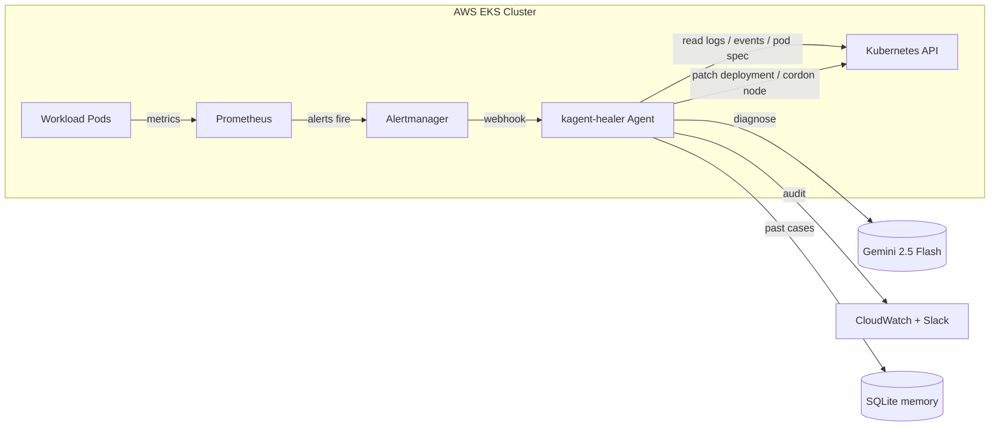

# Self-Healing Kubernetes Cluster with KAgent + Gemini AI

An AI-powered self-healing platform for Amazon EKS. Prometheus alerts are routed
to a Python agent running KAgent, which calls Gemini 2.5 Flash to diagnose the
root cause, then executes a safe Kubernetes remediation (restart, scale, cordon,
or drain) behind a confidence threshold and a dry-run gate.

---

## Architecture diagram



---

## Tech stack

| Layer            | Technology                       | Purpose                                                       |
|------------------|----------------------------------|---------------------------------------------------------------|
| Infrastructure   | AWS EKS, VPC, ECR, Secrets Mgr   | Managed Kubernetes + image registry + secret store            |
| IaC              | Terraform 1.10+, S3 native locking  | Reproducible cluster provisioning (no DynamoDB needed)     |
| Observability    | kube-prometheus-stack, Loki, Grafana | Metrics, logs, alerting, dashboards                       |
| Chaos            | Litmus ChaosCenter               | Repeatable failure injection                                  |
| AI               | Google Gemini 2.5 Flash          | LLM diagnosis + remediation plan                              |
| Agent framework  | KAgent                           | Agent runtime / multi-stage pipeline                          |
| Runtime          | Python 3.11 (FastAPI-style HTTP) | Webhook server, K8s client, Gemini SDK                        |
| Memory           | SQLite (stdlib)                  | Past incident store — no external DB needed                   |
| Packaging        | Docker (multi-stage, non-root, amd64+arm64) | Reproducible agent image, runs on Graviton nodes     |
| Deployment       | Helm v3                          | Templated K8s install of the agent                            |
| CI/CD            | GitHub Actions + OIDC            | Lint, test, build, push, tag, terraform plan/apply            |

---

## Prerequisites

You need the seven tools below installed locally before running anything in
this repo. Each section shows install commands and a verify-step with the
exact output to expect.

### 1. AWS CLI v2

Linux:
```bash
curl "https://awscli.amazonaws.com/awscli-exe-linux-x86_64.zip" -o "awscliv2.zip"
unzip awscliv2.zip
sudo ./aws/install
```

macOS (Homebrew):
```bash
brew install awscli
```

Windows (PowerShell, as Administrator):
```powershell
msiexec.exe /i https://awscli.amazonaws.com/AWSCLIV2.msi
```

Configure credentials and verify:
```bash
aws configure
aws sts get-caller-identity
```

Expected output:
```
{
    "UserId": "AIDAEXAMPLE",
    "Account": "123456789012",
    "Arn": "arn:aws:iam::123456789012:user/your-name"
}
```

**Success indicator:** `Account` shows your 12-digit AWS account ID.

### 2. Terraform >= 1.10

Linux:
```bash
wget -O - https://apt.releases.hashicorp.com/gpg | sudo gpg --dearmor -o /usr/share/keyrings/hashicorp-archive-keyring.gpg
echo "deb [signed-by=/usr/share/keyrings/hashicorp-archive-keyring.gpg] https://apt.releases.hashicorp.com $(lsb_release -cs) main" | sudo tee /etc/apt/sources.list.d/hashicorp.list
sudo apt-get update && sudo apt-get install terraform
```

macOS:
```bash
brew tap hashicorp/tap
brew install hashicorp/tap/terraform
```

Verify:
```bash
terraform --version
```

Expected output:
```
Terraform v1.10.5
```

**Success indicator:** Version is 1.10 or newer.

### 3. kubectl (pinned to 1.32)

Linux:
```bash
curl -LO "https://dl.k8s.io/release/v1.32.0/bin/linux/amd64/kubectl"
sudo install -o root -g root -m 0755 kubectl /usr/local/bin/kubectl
```

macOS:
```bash
brew install kubernetes-cli
```

Verify:
```bash
kubectl version --client
```

Expected output:
```
Client Version: v1.32.0
Kustomize Version: v5.5.0
```

**Success indicator:** Client version starts with `v1.32`.

### 4. Helm v3

Linux / macOS:
```bash
curl https://raw.githubusercontent.com/helm/helm/main/scripts/get-helm-3 | bash
```

Verify:
```bash
helm version
```

Expected output:
```
version.BuildInfo{Version:"v3.14.4", GitCommit:"...", ...}
```

**Success indicator:** Version is v3.x.

### 5. Docker

Linux:
```bash
curl -fsSL https://get.docker.com | sh
sudo usermod -aG docker "$USER"
newgrp docker
```

macOS:
```bash
brew install --cask docker
open -a Docker
```

Verify:
```bash
docker run hello-world
```

Expected output:
```
Hello from Docker!
This message shows that your installation appears to be working correctly.
```

**Success indicator:** The Docker daemon prints the "Hello from Docker!" message.

### 6. Google Gemini API key

Generate a free key at https://aistudio.google.com → **Get API key**.

Verify:
```bash
export GEMINI_API_KEY=your-key-here
curl -s "https://generativelanguage.googleapis.com/v1beta/models?key=${GEMINI_API_KEY}" \
  | jq '.models[0].name'
```

Expected output:
```
"models/gemini-2.5-flash"
```

**Success indicator:** A model name string is returned (no `error:` block).

### 7. jq (used by the verify steps above)

Linux:
```bash
sudo apt-get install jq
```

macOS:
```bash
brew install jq
```

### AWS IAM requirements

The IAM principal you use for `terraform apply` needs these AWS managed
policies (or an equivalent custom policy):

| Policy                                | Why it's needed                                                  |
|---------------------------------------|------------------------------------------------------------------|
| `AmazonEC2FullAccess`                 | VPC, subnets, NAT gateways, EIPs, security groups                |
| `AmazonEKSClusterPolicy` (attach to role created by TF) | Standard EKS control-plane permissions      |
| `IAMFullAccess`                       | Create the cluster, node, and IRSA roles + policies              |
| `AmazonEC2ContainerRegistryFullAccess`| Create + push to the `kagent-healer` ECR repository              |
| `SecretsManagerReadWrite`             | Push the Gemini API key + Slack webhook to Secrets Manager       |
| `AmazonS3FullAccess`                  | Terraform state bucket access                                    |
| `CloudWatchLogsFullAccess`            | Cluster log groups                                               |

Production accounts should narrow these — the policies above are a fast-path
for a fresh dev account.

---

## Deployment — step by step

### Step 1 — Fork and clone the repository

```bash
git clone https://github.com/YOUR_USERNAME/self-healing-k8s-kagent.git
cd self-healing-k8s-kagent
```

**Success indicator:** `ls` shows `Makefile`, `terraform/`, `agent/`, `helm/`,
`k8s/`, `scripts/`.

### Step 2 — Create the Terraform state bucket

Terraform 1.10+ uses [S3 native state locking](https://developer.hashicorp.com/terraform/language/backend/s3#state-locking) via
conditional writes — no DynamoDB table required.

```bash
export AWS_REGION=ap-south-1
export TF_STATE_BUCKET="my-name-tf-state-$(aws sts get-caller-identity --query Account --output text)"

# Create the S3 bucket with versioning + encryption.
aws s3api create-bucket \
  --bucket "$TF_STATE_BUCKET" \
  --region "$AWS_REGION" \
  --create-bucket-configuration LocationConstraint="$AWS_REGION"

aws s3api put-bucket-versioning \
  --bucket "$TF_STATE_BUCKET" \
  --versioning-configuration Status=Enabled

aws s3api put-bucket-encryption \
  --bucket "$TF_STATE_BUCKET" \
  --server-side-encryption-configuration '{
    "Rules": [{"ApplyServerSideEncryptionByDefault": {"SSEAlgorithm": "AES256"}}]
  }'
```

Verify:
```bash
aws s3 ls | grep "$TF_STATE_BUCKET"
```

Expected output:
```
2026-05-18 12:34:56 my-name-tf-state-123456789012
```

**Success indicator:** Bucket appears in `aws s3 ls` with versioning enabled.

### Step 3 — Configure and provision infrastructure

Copy the example tfvars file and edit it:
```bash
cp terraform/terraform.tfvars.example terraform/terraform.tfvars
```

Open `terraform/terraform.tfvars` and set these values:

| Variable             | Example                                  | Notes                                                    |
|----------------------|------------------------------------------|----------------------------------------------------------|
| `aws_region`         | `ap-south-1`                              | Match the region you used in Step 2                      |
| `cluster_name`       | `self-healing-cluster`                   | Becomes the EKS cluster name                             |
| `cluster_version`    | `1.32`                                   | Pinned to match the kubectl version                      |
| `environment`        | `dev`                                    | `dev` keeps NAT GW at 1 by default — cheaper             |
| `system_node_type`   | `t3.medium`                              | Used by add-ons (coredns, monitoring, kagent control plane) |
| `workload_node_type` | `t3.large`                               | Used by demo workloads + healer agent                    |
| `system_node_count`  | `2`                                      | Two nodes survives a single AZ failure                   |
| `workload_node_count`| `2`                                      | Two = the minimum for HPA experiments                    |
| `enable_ha_nat`      | `false`                                  | `true` = one NAT GW per AZ (~3x the cost)                |
| `state_bucket`       | `my-name-tf-state-123456789012`          | The bucket you created in Step 2                         |
| `gemini_api_key`     | from https://aistudio.google.com         | Stored in Secrets Manager — never hardcoded in code      |
| `slack_webhook_url`  | optional `https://hooks.slack.com/...`   | Leave empty to disable Slack notifications               |

Initialize, plan, apply:
```bash
cd terraform
terraform init \
  -backend-config="bucket=${TF_STATE_BUCKET}" \
  -backend-config="region=${AWS_REGION}"

terraform plan -var-file=terraform.tfvars -out=tfplan
terraform apply tfplan
cd ..
```

Expected output (last lines of `apply`):
```
Apply complete! Resources: 47 added, 0 changed, 0 destroyed.

Outputs:

aws_account_id = "123456789012"
aws_region = "ap-south-1"
cluster_endpoint = "https://EXAMPLE.gr7.ap-south-1.eks.amazonaws.com"
cluster_name = "self-healing-cluster"
ecr_repository_url = "123456789012.dkr.ecr.ap-south-1.amazonaws.com/kagent-healer"
gemini_secret_arn = "arn:aws:secretsmanager:ap-south-1:123456789012:secret:kagent/gemini-api-key-AbCdEf"
kagent_irsa_role_arn = "arn:aws:iam::123456789012:role/kagent-healer-irsa"
kubeconfig_command = "aws eks update-kubeconfig --region ap-south-1 --name self-healing-cluster"
private_subnet_ids = ["subnet-aaa", "subnet-bbb", "subnet-ccc"]
public_subnet_ids = ["subnet-xxx", "subnet-yyy", "subnet-zzz"]
vpc_id = "vpc-0abcdef0123456789"
```

Export the outputs you'll reuse:
```bash
export ECR_URL=$(terraform -chdir=terraform output -raw ecr_repository_url)
export KAGENT_IRSA_ARN=$(terraform -chdir=terraform output -raw kagent_irsa_role_arn)
export AWS_ACCOUNT_ID=$(terraform -chdir=terraform output -raw aws_account_id)
```

**Success indicator:** `aws eks list-clusters --region $AWS_REGION` includes
`self-healing-cluster`.

### Step 4 — Configure kubectl

```bash
aws eks update-kubeconfig --region "$AWS_REGION" --name self-healing-cluster
kubectl get nodes
```

Expected output:
```
NAME                                            STATUS   ROLES    AGE   VERSION
ip-10-0-1-12.ap-south-1.compute.internal         Ready    <none>   3m    v1.32.0-eks-...
ip-10-0-2-45.ap-south-1.compute.internal         Ready    <none>   3m    v1.32.0-eks-...
ip-10-0-3-78.ap-south-1.compute.internal         Ready    <none>   3m    v1.32.0-eks-...
ip-10-0-1-90.ap-south-1.compute.internal         Ready    <none>   3m    v1.32.0-eks-...
```

**Success indicator:** All nodes show `STATUS=Ready` and run version `v1.32.x`.

### Step 5 — Install cluster add-ons

#### 5a — Metrics Server

```bash
kubectl apply -f https://github.com/kubernetes-sigs/metrics-server/releases/latest/download/components.yaml
sleep 30
kubectl top nodes
```

Expected output:
```
NAME                                       CPU(cores)   CPU%   MEMORY(bytes)   MEMORY%
ip-10-0-1-12.ap-south-1.compute.internal    47m          2%     412Mi           12%
...
```

**Success indicator:** Each node shows non-empty CPU% and MEMORY% values.

#### 5b — kube-prometheus-stack

```bash
helm repo add prometheus-community https://prometheus-community.github.io/helm-charts
helm repo update

helm upgrade --install monitoring prometheus-community/kube-prometheus-stack \
  --namespace monitoring --create-namespace \
  --set grafana.adminPassword='admin' \
  --set prometheus.prometheusSpec.serviceMonitorSelectorNilUsesHelmValues=false \
  --set prometheus.prometheusSpec.ruleSelectorNilUsesHelmValues=false \
  --wait
```

Verify:
```bash
kubectl get pods -n monitoring
```

Expected output (abbreviated):
```
NAME                                                     READY   STATUS    RESTARTS   AGE
alertmanager-monitoring-kube-prometheus-alertmanager-0   2/2     Running   0          2m
monitoring-grafana-78d9b9f786-2xkp4                      3/3     Running   0          2m
monitoring-kube-prometheus-operator-...                  1/1     Running   0          2m
monitoring-kube-state-metrics-...                        1/1     Running   0          2m
monitoring-prometheus-node-exporter-...                  1/1     Running   0          2m
prometheus-monitoring-kube-prometheus-prometheus-0       2/2     Running   0          2m
```

**Success indicator:** Every monitoring pod is `Running` with no `RESTARTS`.

#### 5c — Loki + Promtail

Loki ships pod logs to Grafana so the **"Recent healing events"** dashboard panel
and the log-based alert rules work. Promtail runs as a DaemonSet and tails every
node's container logs.

```bash
helm repo add grafana https://grafana.github.io/helm-charts
helm repo update

helm upgrade --install loki grafana/loki-stack \
  --namespace monitoring --create-namespace \
  -f helm/loki/values.yaml --wait
```

Apply the datasource ConfigMap so Grafana's sidecar auto-provisions Loki — no
manual datasource setup needed:

```bash
kubectl apply -f k8s/monitoring/loki-datasource.yaml
```

Verify:
```bash
kubectl get pods -n monitoring | grep loki
```

Expected output:
```
loki-0                             1/1     Running   0          90s
loki-promtail-abcd1                1/1     Running   0          90s
loki-promtail-abcd2                1/1     Running   0          90s
loki-promtail-abcd3                1/1     Running   0          90s
```

**Success indicator:** `loki-0` is `Running` and one `loki-promtail-*` pod exists
per node. In Grafana → Configuration → Data sources you should see **Loki** listed.

#### 5d — Litmus ChaosCenter

```bash
helm repo add litmuschaos https://litmuschaos.github.io/litmus-helm/
helm repo update

helm install litmus litmuschaos/litmus \
  --namespace litmus --create-namespace \
  --wait
```

Verify:
```bash
kubectl get pods -n litmus
```

**Success indicator:** Litmus frontend / backend / mongo pods all show `Running`.

#### 5e — KAgent

```bash
helm repo add kagent https://kagent-dev.github.io/kagent
helm repo update

# CRDs first (KAgent requires them installed and established before the chart).
helm install kagent-crds kagent/kagent-crds \
  --namespace kagent --create-namespace
sleep 15

helm install kagent kagent/kagent \
  --namespace kagent \
  --set providers.default=gemini \
  --wait
```

Verify:
```bash
kubectl get pods -n kagent
```

**Success indicator:** All KAgent pods (controller, UI, gateway) show `Running`.

### Step 6 — Push secrets to AWS Secrets Manager

> Terraform already wrote your Gemini key (and optional Slack webhook) to
> Secrets Manager in Step 3. This step is the **rotation** procedure —
> use it whenever you regenerate a key.

```bash
export GEMINI_API_KEY="your-new-key"
aws secretsmanager put-secret-value \
  --secret-id kagent/gemini-api-key \
  --secret-string "$GEMINI_API_KEY" \
  --region "$AWS_REGION"

# (optional) Slack webhook
aws secretsmanager put-secret-value \
  --secret-id kagent/slack-webhook \
  --secret-string "https://hooks.slack.com/services/..." \
  --region "$AWS_REGION"
```

Expected output:
```
{
    "ARN": "arn:aws:secretsmanager:ap-south-1:123456789012:secret:kagent/gemini-api-key-AbCdEf",
    "Name": "kagent/gemini-api-key",
    "VersionId": "...",
    "VersionStages": ["AWSCURRENT"]
}
```

Verify:
```bash
aws secretsmanager get-secret-value \
  --secret-id kagent/gemini-api-key \
  --region "$AWS_REGION" \
  --query SecretString --output text | head -c 8 ; echo
```

**Success indicator:** The first 8 characters of your key are printed.

### Step 7 — Apply alert rules and Grafana dashboard

```bash
kubectl apply -f k8s/monitoring/alert-rules.yaml
kubectl apply -f k8s/monitoring/alertmanager-config.yaml
kubectl apply -f k8s/monitoring/loki-datasource.yaml
kubectl apply -f k8s/monitoring/grafana-dashboard-configmap.yaml

kubectl get prometheusrule -n monitoring
```

Expected output:
```
NAME                                                    AGE
kagent-healer-rules                                     10s
...
```

**Success indicator:** `kagent-healer-rules` is listed. Open Grafana → Alerting
→ Alert rules to confirm 5 rules under group `kagent.healing`.

### Step 8 — Build and push the agent image

```bash
export ECR_URL=$(terraform -chdir=terraform output -raw ecr_repository_url)
export AWS_ACCOUNT_ID=$(terraform -chdir=terraform output -raw aws_account_id)
echo "ECR: ${ECR_URL}"

aws ecr get-login-password --region "$AWS_REGION" | \
  docker login --username AWS --password-stdin "${ECR_URL}"

docker build -t kagent-healer:latest .

docker tag kagent-healer:latest "${ECR_URL}:latest"
docker push "${ECR_URL}:latest"
```

Expected output (last lines):
```
latest: digest: sha256:abc123... size: 1234
```

Verify image is in ECR:
```bash
aws ecr describe-images --repository-name kagent-healer --region "$AWS_REGION" \
  --query 'imageDetails[*].{Tag:imageTags[0],Pushed:imagePushedAt,Size:imageSizeInBytes}'
```

**Success indicator:** Image appears with tag `latest` and a recent push timestamp.

### Step 9 — Deploy the healer agent

```bash
helm upgrade --install kagent-healer helm/kagent-healer/ \
  --namespace kagent \
  --create-namespace \
  --set image.repository="${ECR_URL}" \
  --set image.tag=latest \
  --set serviceAccount.annotations."eks\.amazonaws\.com/role-arn"="${KAGENT_IRSA_ARN}" \
  --set agent.dryRun="true" \
  --wait
```

For production clusters, overlay `values-prod.yaml` which enables live healing,
higher confidence threshold (0.80), HPA, PodDisruptionBudget, and NetworkPolicy:

```bash
helm upgrade --install kagent-healer helm/kagent-healer/ \
  --namespace kagent \
  -f helm/kagent-healer/values-prod.yaml \
  --set image.repository="${ECR_URL}" \
  --set image.tag=latest \
  --set serviceAccount.annotations."eks\.amazonaws\.com/role-arn"="${KAGENT_IRSA_ARN}" \
  --wait

kubectl get pods -n kagent -l app.kubernetes.io/name=kagent-healer
```

Expected output:
```
NAME                              READY   STATUS    RESTARTS   AGE
kagent-healer-6d8f9b7c4-xk2pv     1/1     Running   0          45s
```

Verify the health endpoint via port-forward:
```bash
kubectl -n kagent port-forward svc/kagent-healer 8000:8000 &
curl http://localhost:8000/health
kill %1 2>/dev/null
```

Expected response:
```json
{"status":"ok","version":"1.0.0"}
```

**Success indicator:** Pod shows `1/1 Running` and `/health` returns `{"status":"ok"}`.

### Step 10 — Verify the end-to-end healing loop

Inject a crash-looping deployment:
```bash
kubectl apply -f k8s/test-workloads/crash-loop.yaml
kubectl get pods -n default -w
```

Wait until the pod shows `CrashLoopBackOff`. In another terminal, tail the
agent logs:
```bash
kubectl logs -n kagent -l app.kubernetes.io/name=kagent-healer -f
```

Expected agent log lines (abridged):
```
2026-05-18 12:34:56 INFO agent.webhook_server | Received alert: PodCrashLooping default/crash-test-...
2026-05-18 12:34:56 INFO agent.agents.triage_agent | Triage: accepted alert PodCrashLooping:default:crash-test-... (severity=critical weight=3)
2026-05-18 12:34:58 INFO agent.gemini_client | Gemini diagnosis: action=restart_pod target=default/crash-test confidence=0.88
2026-05-18 12:34:58 INFO agent.remediator | DRY_RUN: would execute action=restart_pod target=default/crash-test confidence=0.88
2026-05-18 12:34:58 INFO agent.agents.audit_agent | AUDIT {"timestamp":"...","action":"restart_pod","executed":true,"dry_run":true,...}
```

**Success indicator:** Agent log shows `Gemini diagnosis: action=restart_pod`
followed by an `AUDIT` line for the same alert.

To switch to **live** healing (no dry-run), re-run the Helm command from Step 9
with `--set agent.dryRun="false"` — see [Enabling live healing](#enabling-live-healing-dry_runfalse).

---

## Running the demo

```bash
./scripts/demo.sh
```

The script runs nine phases. Each is annotated below so you can follow what
you're watching on screen:

1. **Cluster health check** — verifies all nodes and the healer pod are Running.
2. **Crash-loop injection** — applies `k8s/test-workloads/crash-loop.yaml`, a
   busybox deployment that exits with code 1 every 5 seconds.
3. **Alert firing** — waits up to 3 minutes (animated spinner) for Prometheus
   to fire the `PodCrashLooping` alert and Alertmanager to deliver it to the
   agent.
4. **Gemini diagnosis** — tails the agent log until you see
   `Gemini diagnosis: action=...` with a real confidence score.
5. **Healing action** — the `restart_pod` action is logged (dry-run by default).
6. **OOM injection** — applies `oom-test.yaml`, which immediately exceeds its
   64Mi memory limit and is OOMKilled.
7. **Litmus chaos** — runs a `pod-delete` experiment on the `demo-app`
   deployment.
8. **Audit summary** — prints the last 20 lines of `/tmp/kagent-audit.jsonl`
   inside the agent pod.
9. **Cleanup** — deletes all three test workloads.

At the end the script prints the port-forward commands for Grafana, Prometheus
and Alertmanager.

---

## Healing actions reference

| Alert                | PromQL trigger                                                                            | Action         | Confidence needed | What happens                                                                |
|----------------------|-------------------------------------------------------------------------------------------|----------------|-------------------|-----------------------------------------------------------------------------|
| `PodCrashLooping`    | `rate(kube_pod_container_status_restarts_total[5m]) * 60 > 0.5` for 1m                    | `restart_pod`  | ≥ 0.75            | Patches the Deployment's `kubectl.kubernetes.io/restartedAt` annotation     |
| `PodOOMKilled`       | `kube_pod_container_status_last_terminated_reason{reason="OOMKilled"} == 1`               | `restart_pod` *or* `scale_up` | ≥ 0.75 | If Gemini sees repeated OOMs across replicas, prefers `scale_up`            |
| `PodPendingTooLong`  | `kube_pod_status_phase{phase="Pending"} == 1` for 5m                                      | `scale_up` *or* `notify_only` | ≥ 0.75 | Bumps replicas by 1 up to `MAX_REPLICAS` if cause is taint/resource pressure |
| `NodeNotReady`       | `kube_node_status_condition{condition="Ready",status="true"} == 0` for 2m                 | `cordon_node` *or* `drain_node` | ≥ 0.80 + HITL | Slack approval required; drain evicts all non-DaemonSet pods (respects PDBs) |
| `PVCUsageHigh`       | `kubelet_volume_stats_used_bytes / kubelet_volume_stats_capacity_bytes > 0.85` for 5m     | `notify_only`  | n/a               | Storage growth is a human decision — agent never resizes PVCs               |

All confidence values below `0.70` are forced to `notify_only` regardless of
the action Gemini suggests (see [`agent/gemini_client.py`](agent/gemini_client.py)).

---

## Configuration reference

| Env var                 | Helm value                          | Description                                                          | Default                       | Required          |
|-------------------------|-------------------------------------|----------------------------------------------------------------------|-------------------------------|-------------------|
| `GEMINI_API_KEY`        | (from Secrets Manager)              | Google Gemini API key                                                | —                             | yes               |
| `GEMINI_MODEL`          | `agent.geminiModel`                 | Gemini model to call                                                 | `gemini-2.5-flash`            | no                |
| `DRY_RUN`               | `agent.dryRun`                      | If `true`, log actions but do not touch the cluster                  | `true`                        | no                |
| `CONFIDENCE_THRESHOLD`  | `agent.confidenceThreshold`         | Minimum Gemini confidence to act                                     | `0.75`                        | no                |
| `MAX_REPLICAS`          | `agent.maxReplicas`                 | Hard cap for `scale_up`                                              | `10`                          | no                |
| `DAILY_REQUEST_LIMIT`   | `agent.dailyRequestLimit`           | Max Gemini API calls per UTC day                                     | `200`                         | no                |
| `MEMORY_DB_PATH`        | `agent.memoryDbPath`                | SQLite file for the incident memory                                  | `/tmp/kagent-memory.db`       | no                |
| `AUDIT_LOG_PATH`        | `agent.auditLogPath`                | JSONL audit log path                                                 | `/tmp/kagent-audit.jsonl`     | no                |
| `LOG_LEVEL`             | `agent.logLevel`                    | Python log level                                                     | `INFO`                        | no                |
| `SECRETS_MANAGER_REGION`| `agent.secretsManagerRegion`        | Region used by boto3 at startup                                      | `ap-south-1`                   | no                |
| `GEMINI_API_KEY_SECRET` | `agent.geminiApiKeySecret`          | Secrets Manager ID for the Gemini key                                | `kagent/gemini-api-key`       | no                |
| `SLACK_WEBHOOK_SECRET`  | `agent.slackWebhookSecret`          | Secrets Manager ID for the Slack URL (optional)                      | `kagent/slack-webhook`        | no                |
| `WEBHOOK_PORT`          | `service.webhookPort`               | HTTP port for the Alertmanager webhook                               | `8000`                        | no                |
| `METRICS_PORT`          | `service.metricsPort`               | Prometheus metrics port                                              | `8001`                        | no                |

---

## Prometheus metrics exposed

The agent serves metrics on `:8001` (scraped by the `ServiceMonitor`).

| Metric | Type | Labels | Description |
|--------|------|--------|-------------|
| `kagent_alerts_total` | Counter | `severity` | Alerts received through the webhook |
| `kagent_gemini_calls_total` | Counter | — | Total Gemini API calls |
| `kagent_actions_total` | Counter | `action`, `executed` | Healing actions attempted |
| `kagent_healing_seconds` | Histogram | — | End-to-end alert→resolution latency |
| `kagent_last_confidence` | Gauge | — | Confidence score from the last Gemini response |
| `kagent_requests_remaining_today` | Gauge | — | Remaining Gemini budget for the current UTC day |
| `kagent_stage_duration_seconds` | Histogram | `stage` | Per-stage duration: `triage`, `diagnosis`, `remediation`, `audit` |
| `kagent_stage_errors_total` | Counter | `stage` | Errors thrown by each pipeline stage |

The Grafana dashboard surfaces all of these across 13 panels including p50/p95
per-stage latency, stage error rate, and a budget-remaining stat with colour
thresholds (red < 10, yellow < 50, green ≥ 50).

---

## Custom alert rules

To add a new rule:

1. Open [`k8s/monitoring/alert-rules.yaml`](k8s/monitoring/alert-rules.yaml).
2. Append a new entry under `spec.groups[0].rules` with these required
   annotations so the agent can build context:
   ```yaml
   - alert: MyNewAlert
     expr: my_metric{namespace=~".+"} > 0
     for: 2m
     labels:
       severity: warning
       kagent: "true"   # <-- required, so Alertmanager routes it to the healer
     annotations:
       summary: "Something happened in {{ $labels.namespace }}/{{ $labels.pod }}"
       pod: "{{ $labels.pod }}"            # <-- required for context_builder
       namespace: "{{ $labels.namespace }}"  # <-- required for context_builder
   ```
3. Apply: `kubectl apply -f k8s/monitoring/alert-rules.yaml`.
4. Verify in Prometheus UI (`/alerts`) and watch the agent log for the first
   firing.

The `kagent: "true"` label is what makes Alertmanager match the route in
`k8s/monitoring/alertmanager-config.yaml`. Without it the alert fires in
Prometheus but never reaches the agent.

### Built-in self-monitoring rules

Three rules in `alert-rules.yaml` watch the agent itself (note `kagent: "false"` —
they fire to your normal alerting channel, not back into the healer):

| Alert | Condition | Severity |
|-------|-----------|----------|
| `KAgentDown` | Agent unreachable for 2m (`up{job="kagent-healer"} == 0`) | critical |
| `KAgentBudgetNearExhaustion` | < 20 Gemini requests remaining today | warning |
| `KAgentHighStageErrorRate` | > 0.5 stage errors/min over 5m | warning |

---

## Enabling live healing (`DRY_RUN=false`)

`DRY_RUN=true` is the default. When dry-run is on, the agent logs the action
it would take but does not patch any Kubernetes object.

To enable live healing:

```bash
helm upgrade --install kagent-healer helm/kagent-healer/ \
  --namespace kagent \
  --reuse-values \
  --set agent.dryRun="false"

kubectl rollout status deploy/kagent-healer -n kagent
```

To confirm it took effect, inject a crash-loop and watch:
```bash
kubectl apply -f k8s/test-workloads/crash-loop.yaml
kubectl get deployment crash-test -n default -o yaml \
  | grep restartedAt
```

You should see a `kubectl.kubernetes.io/restartedAt` annotation appear within
a couple of minutes (the agent patches it to trigger a rollout).

---

## AWS cost estimate

| Service                                     | Spin-up / spin-down session (~1 hr) | Always-on dev (24×7)         | Notes                                          |
|---------------------------------------------|--------------------------------------|------------------------------|------------------------------------------------|
| EKS control plane                           | $0.10                                | ~$73 / mo                    | $0.10/hr regardless of node count              |
| EC2 — system nodes (`t3.medium` × 2)        | $0.08                                | ~$60 / mo                    | On-demand pricing                              |
| EC2 — workload nodes (`t3.large` × 2)       | $0.16                                | ~$116 / mo                   | On-demand pricing                              |
| NAT Gateway (×1, `enable_ha_nat = false`)   | $0.045                               | ~$33 / mo                    | Plus per-GB data charges (small for this repo) |
| ECR storage                                 | ~negligible                          | ~$1 / mo                     | Lifecycle keeps last 10 images                 |
| AWS Secrets Manager (2 secrets)             | $0.001                               | ~$0.80 / mo                  | $0.40 per secret per month                     |
| Gemini API                                  | $0                                   | $0                           | Free tier covers this workload                 |
| **Total**                                   | **~$0.39 / hr (~$4–6 per session)**  | **~$285 / mo always-on**     | See Teardown below to stop billing             |

When you're done for the day, run `./scripts/teardown.sh` — see the
[Teardown](#teardown) section for what it actually does.

---

## Day-2 operations

### Open all service UIs

```bash
make port-forward   # or ./scripts/port-forward.sh
```

This starts six tunnels simultaneously:

| Service | URL | Credentials |
|---------|-----|-------------|
| Grafana | `http://localhost:3000` | admin / admin |
| Prometheus | `http://localhost:9090` | — |
| Alertmanager | `http://localhost:9093` | — |
| Loki (LogQL API) | `http://localhost:3100` | — |
| KAgent UI | `http://localhost:8080` | — |
| Healer webhook | `http://localhost:8000/health` | — |

Press `Ctrl-C` to stop all tunnels. Logs for each forward are written to
`/tmp/kagent-portforward/`.

### View agent logs

```bash
kubectl logs -n kagent -l app.kubernetes.io/name=kagent-healer --tail=200 -f
```

### Check the audit log

```bash
POD=$(kubectl get pod -n kagent -l app.kubernetes.io/name=kagent-healer -o jsonpath='{.items[0].metadata.name}')
kubectl exec -n kagent "$POD" -- cat /tmp/kagent-audit.jsonl | jq -r '.'
```

### Manually test the healing loop

```bash
kubectl apply -f k8s/test-workloads/crash-loop.yaml
kubectl logs -n kagent -l app.kubernetes.io/name=kagent-healer -f
# When you see the audit entry:
kubectl delete -f k8s/test-workloads/crash-loop.yaml
```

### Rolling restart the agent

```bash
kubectl rollout restart deployment/kagent-healer -n kagent
kubectl rollout status deployment/kagent-healer -n kagent
```

### Rotate the Gemini API key

```bash
aws secretsmanager put-secret-value \
  --secret-id kagent/gemini-api-key \
  --secret-string "new-gemini-key" \
  --region ap-south-1

# Force the pod to re-read the secret (it's read on startup).
kubectl rollout restart deployment/kagent-healer -n kagent
```

### Update the agent image to a new SHA

```bash
helm upgrade --install kagent-healer helm/kagent-healer/ \
  --namespace kagent \
  --reuse-values \
  --set image.tag="$NEW_SHA"
```

---

## Troubleshooting

### 1. Agent pod not starting — `CrashLoopBackOff`

Symptom:
```
NAME                              READY   STATUS             RESTARTS   AGE
kagent-healer-6d8f9b7c4-xk2pv     0/1     CrashLoopBackOff   4          2m
```

Diagnosis:
```bash
kubectl describe pod -n kagent kagent-healer-6d8f9b7c4-xk2pv
kubectl logs -n kagent kagent-healer-6d8f9b7c4-xk2pv --previous
```

Most common cause is a missing or unreadable Gemini API key — the agent fails
at startup when boto3 cannot fetch the secret.

Fix:
```bash
# Confirm the secret exists and is readable.
aws secretsmanager get-secret-value --secret-id kagent/gemini-api-key --region ap-south-1

# Confirm the ServiceAccount is annotated with the IRSA role ARN.
kubectl get sa -n kagent kagent-healer -o yaml | grep eks.amazonaws.com/role-arn

# If missing, re-run the helm upgrade with --set serviceAccount.annotations...
```

**Success indicator:** `kubectl get pods -n kagent` shows `1/1 Running`.

### 2. Alerts fire in Prometheus but the agent log shows nothing

Symptom: `/alerts` in Prometheus shows `PodCrashLooping = firing`, but
`kubectl logs -n kagent` is silent.

Diagnosis:
```bash
kubectl get alertmanagerconfig -n monitoring
kubectl describe alertmanagerconfig -n monitoring kagent-healer
kubectl -n monitoring port-forward svc/monitoring-kube-prometheus-alertmanager 9093:9093 &
curl -s http://localhost:9093/api/v2/status | jq '.config.original' | head -40
```

Fix: the AlertmanagerConfig needs `kagent: "true"` matcher AND the Prometheus
Operator must be picking up `AlertmanagerConfig` resources. Check that the
prometheus-stack release was installed with
`alertmanagerConfigSelector` matching your namespace, or set
`alertmanagerConfigSelectorNilUsesHelmValues=false`.

### 3. Gemini returns low confidence (below 0.75) repeatedly

Symptom: Agent logs show `action=notify_only` over and over.

Diagnosis: Context builder is probably returning empty logs / events because
the pod was already deleted by the time we tried to read it.

```bash
POD=$(kubectl get pod -n kagent -l app.kubernetes.io/name=kagent-healer -o jsonpath='{.items[0].metadata.name}')
kubectl exec -n kagent "$POD" -- python -c "
from agent.context_builder import ContextBuilder
ctx = ContextBuilder().build({'labels': {'alertname':'X','namespace':'default','pod':'crash-test-abc'}})
for k, v in ctx.items():
    print(k, '=', repr(v)[:200])
"
```

Fix: lower `CONFIDENCE_THRESHOLD` cautiously (e.g. `0.65`) only if you've
verified that the context is rich enough.

### 4. PVC stuck in `Pending` — no `StorageClass`

Symptom:
```
NAME       STATUS    VOLUME   STORAGECLASS   AGE
data-...   Pending             gp2            2m
```

EKS 1.32 ships `gp2` as a non-default class and `aws-ebs-csi-driver` as the
provisioner. Fix:
```bash
kubectl patch storageclass gp2 -p '{"metadata":{"annotations":{"storageclass.kubernetes.io/is-default-class":"true"}}}'
```

### 5. `kubectl logs` works for the agent but not for application pods

Symptom: `kubectl logs -n default crash-test-...` returns
`Error from server: Get ... dial tcp ...: i/o timeout`.

That's a kubelet-to-control-plane port-10250 reachability issue, usually due to
the worker security group missing an inbound rule on 10250. Fix:
```bash
SG=$(aws eks describe-cluster --name self-healing-cluster --region ap-south-1 \
  --query 'cluster.resourcesVpcConfig.clusterSecurityGroupId' --output text)
aws ec2 authorize-security-group-ingress --group-id "$SG" \
  --protocol tcp --port 10250 --source-group "$SG" --region ap-south-1
```

### 6. `DRY_RUN=false` but no actions are executing

Likely cause #1: the target namespace is in `PROTECTED_NAMESPACES`. Check
[`agent/remediator.py`](agent/remediator.py).

Likely cause #2: confidence is below threshold — check the log line
`Confidence X.XX below threshold 0.75`.

Likely cause #3: the daily budget is exhausted — log line
`CostGuard: daily limit reached`.

### 7. Gemini API key is invalid

Symptom: agent log shows
`Gemini call failed: 400 INVALID_ARGUMENT API key not valid`.

Fix:
```bash
# Verify the key by hand
curl -s "https://generativelanguage.googleapis.com/v1beta/models?key=YOUR_KEY" | jq '.error // .models[0].name'

# Then rotate (Step 6) and restart the agent
aws secretsmanager put-secret-value --secret-id kagent/gemini-api-key \
  --secret-string "new-key" --region ap-south-1
kubectl rollout restart deployment/kagent-healer -n kagent
```

### 8. ECR push denied — `no basic auth credentials`

Symptom: `docker push ... no basic auth credentials`.

Fix:
```bash
# Confirm IAM identity is allowed to push
aws ecr get-authorization-token --region ap-south-1 >/dev/null \
  && echo "OK: ECR auth works"

# Re-login and retry
aws ecr get-login-password --region ap-south-1 | \
  docker login --username AWS --password-stdin "${ECR_URL}"
docker push "${ECR_URL}:latest"
```

---

## Teardown

```bash
./scripts/teardown.sh
```

The script asks for a typed confirmation, then runs this order:

1. **Uninstall every Helm release** (`kagent-healer`, `kagent`, `kagent-crds`,
   `monitoring`, `litmus`). This is what triggers the AWS Load Balancer
   Controller and any service-of-type-LoadBalancer to clean up their AWS
   ELBs and target groups.
2. **Delete the namespaces** (`kagent`, `monitoring`, `litmus`). Removes any
   remaining workloads and PVCs.
3. **Wait 60 seconds.** AWS needs time to detach and delete ENIs from the
   private subnets after the controllers tear down their LBs.
4. **Force-delete leftover ELBs / NLBs in the VPC.** Kubernetes controllers
   occasionally miss a load balancer; we sweep them up with `aws elbv2
   delete-load-balancer` so step 5 doesn't hang.
5. **`terraform destroy`.** Now that subnets are clean, this finishes in
   ~10 minutes.

**Why this order matters:** Terraform cannot delete a VPC while any ENI lives
in one of its subnets. If you skip steps 1–4 and run `terraform destroy`
directly, the VPC deletion will retry for 15+ minutes and then fail. Cleaning
up Load Balancers first is the only reliable way to make `terraform destroy`
succeed on the first try.

If `terraform destroy` still fails at step 5, the script prints these manual
recovery commands:
```bash
# List remaining LBs in the VPC
VPC_ID=$(terraform -chdir=terraform output -raw vpc_id)
aws elbv2 describe-load-balancers --region ap-south-1 \
  --query "LoadBalancers[?VpcId=='${VPC_ID}'].LoadBalancerArn" --output text

# Delete each one manually then re-run terraform destroy
aws elbv2 delete-load-balancer --region ap-south-1 --load-balancer-arn <ARN>
sleep 60
terraform -chdir=terraform destroy
```

---


## Contributing

See [CONTRIBUTING.md](CONTRIBUTING.md) for the full guide — setup, code style,
adding healing actions, adding alert rules, and the safety checklist every PR
touching the remediator must pass.

PRs use [`.github/PULL_REQUEST_TEMPLATE.md`](.github/PULL_REQUEST_TEMPLATE.md).
Dependencies are kept up to date automatically via
[Dependabot](.github/dependabot.yml) (weekly updates for Actions, pip, Docker,
and Terraform providers).

## Security

To report a vulnerability, see [SECURITY.md](SECURITY.md). Do **not** open a
public issue.

---
